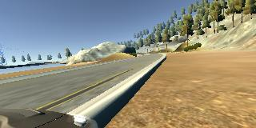

# **Behavioral Cloning**

**Behavioral Cloning Project**

## Overview ##

This project describes a CNN that learns the entire processing pipeline needed to steer a car. The dataset used was generated by a simulator where the images were captured, saved to disk and then used to train the CNN algorithm.

The goals / steps of this project are the following:
* Use the simulator to collect data of good driving behavior
* Build, a convolution neural network (CNN) in Keras that predicts steering angles from images
* Train and validate the model with a training and validation set
* Test that the model successfully drives around track one without leaving the road
* Summarize the results


[//]: # (Image References)

[figure1]: ./images/system-design.jpg "System Design Imge"
[figure2]: ./images/system-design2.jpg "System Design Imge"
[figure3]: ./images/cnn.jpg "CNN Architecture"
[figure4]: ./images/loss.jpg "Train and Validation Loss"
[figure5]: ./images/center.jpg "Center Image"

---
### Code Files Used

#### 1. Files used to run the simulator in autonomous mode

This project includes the following files:

* `model.py` containing the script to create and train the model
* `drive.py` for driving the car in autonomous mode
* model.hdf5 containing a trained convolution neural network
* writeup_report.pdf summarizing the results

#### 2. Command to train the model

This command will create the model.hdf5 file

```phthon
python model.py
```

The `model.py` file contains the code for training and saving the convolution neural network. The file shows the pipeline I used for training and validating the model, and it contains comments to explain how the code works.

#### 2. Command to run in autonomous mode

Using the [simulator](https://github.com/udacity/self-driving-car-sim) provided by Udacity and the `drive.py` file that loads the model, the car can be driven autonomously around the track by executing the command:

```python
python drive.py model.hdf5
```

#### 3. Saving a video of the autonomous agent

```sh
python drive.py model.h5 run1
```

The fourth argument, `run1`, is the directory in which to save the images seen by the agent. If the directory already exists, it'll be overwritten.

Then, the next command creates a video based on images found in the `run1` directory. The name of the video will be the name of the directory followed by `'.mp4'`, so, in this case the video will be `run1.mp4`.

```sh
python video.py run1
```

Optionally, one can specify the FPS (frames per second) of the video:

```sh
python video.py run1 --fps 48
```

Will run the video at 48 FPS. The default FPS is 60.
### System Design Architecture

A block diagram of our training system is shown in Figure 1. Images are fed into a CNN which then computes a proposed steering command. The proposed command is compared to the desired command for that image and the weights of the CNN are adjusted to bring the CNN output closer to the desired output.

![alt text][figure1]
Figure 1. Source Author: [End to End Learning for Self-Driving Cars](https://arxiv.org/abs/1604.07316) paper

Once trained, the network can generate steering from the video images of a single center camera.<br>
This configuration is shown in Figure 2.

![alt text][figure2]
Figure 2. Source Author: [End to End Learning for Self-Driving Cars](https://arxiv.org/abs/1604.07316) paper

The trained network is used to generate streering commands from a single front-facing center camera.

### Model Architecture and Training Strategy

#### 1. An appropriate model architecture has been employed

I created the model architecture based on the one suggested in [this](https://arxiv.org/abs/1604.07316) paper.<br>

![alt text][figure3]

Figure 3. Model Architecture

The model consists of a convolution neural network with 5x5 filter sizes and depths between 24 and 64 (model.py lines 80-96)

The model includes RELU layers to introduce nonlinearity (code line 87-91), and the data is normalized and mean centered in the model using a Keras lambda layer (code line 84).

To accelerate image processing and try to avoid distraction during model training, a cropping layer was added to model architecture, which means that image size was converted from (160,320) to (65,320) (model.py line 86). The removed image slices does not have useful information for model training, but can improve the training process using a less image pixels.

#### 2. Attempts to reduce overfitting in the model

The model was trained and validated on different data sets to ensure that the model was not overfitting (code line 40-51). The model was tested by running it through the simulator and ensuring that the vehicle could stay on the track.

#### 3. Model parameter tuning

The model used an `adam` optimizer, and the learning rate was initialized manually.
 
 ```sh
 batch_size = 64    # line 69
 lr = 0.001         # line 102
 optimizer = 'adam' # line 103
 epochs = 20        # line 129
```

In addition, to get a better model prediction, I added 3 Keras callbacks: `ModelCheckpoint`, `ReduceLROnPlateau`, and `EarlyStopping` (model.py lines 106-120)

#### 4. Appropriate training data

Training data was chosen to keep the vehicle driving on the road. I used a combination of center lane driving, recovering from the left and right sides of the road. 

For details about how I created the training data, see the next section. 

### Model Architecture and Training Strategy

#### 1. Solution Design Approach

The overall strategy for deriving a model architecture was to use a more hobust neural network architecture, to be able to get a good performance during autonomous driving mode.

My first step was to use a convolution neural network model similar to the one used in [this](https://arxiv.org/abs/1604.07316) paper and already described above.

In order to gauge how well the model was working, I split my image and steering angle data into a training and validation set. I found that my first model had a low mean squared error on the training and validation set, but after 10 epochs I started to see a high mean squared error on the validation set, as we can see in the Figure 4. This implied that the model was overfitting. Maybe I was training too long though and the model was starting to learn patterns in training data, which means not generalizing well in validation data. One strategy to avoid overfitting is to add `regularizers` or `dropout`, but before to try this option, I decided to test the trained model.

![alt text][figure4]
Figure 4 - Training and Validation loss.

The final step was to run the simulator to see how well the car was driving around track one. There were a few spots where the vehicle fell off the track... to improve the driving behavior in these cases, I ....

At the end of the process, the vehicle is able to drive autonomously around the track without leaving the road.

#### 2. Final Model Architecture

The final model architecture (model.py lines 82-96) consisted of five convolution neural networks with the following layers and layer sizes.

|Layer     |  Output   |
|:--------:|:-----------:|
|Input     | 160, 320    |
|Cropping2D| 65, 320     |
|Conv2D    | 31, 158, 24 |
|Conv2D    | 14, 77, 36  |
|Conv2D    | 5, 37, 48   |
|Conv2D    | 3, 35, 64   |
|Conv2D    | 1, 33, 64   |
|Flatten   | 2112        |
|Dense     | 100         |
|Dense     | 50          |
|Dense     | 10          |
|Dense     | 1           |

#### 3. Creation of the Training Set & Training Process

To capture good driving behavior, I first recorded two laps on track one using center lane driving. Here is an example image of center lane driving:

![alt text][figure5]
<p align="center"></p>

I then recorded the vehicle on the left lane and right lane to allow the model to learn more features about drive in the road.


<br>

I then recorded the vehicle recovering from the left side and right sides of the road back to center so that the vehicle would learn to go back to center. These images show what a recovery looks like starting from left and right side of the road:


<br>

Then I repeated this process on track two in order to get more data points.

<p align="center">

</p>


<br>

After the collection process, I had 81597 number of data points.<br> I then preprocessed this data by using a generator (model.py lines 28-55). The generator creates a batch of images, loading each image and adjusting the steering measurements for the side camera images. Using this approach, the number of images was 3x the number of loaded images (model.py code lines 40-51). The generator works with a batch size of 64.

I finally randomly shuffled the data set and put 20% of the data into a validation set.

I used this training data for training the model. The validation set helped determine if the model was over or under fitting.<br>
I tested 3 models from 3 different times of the training process: 2 epochs, 10 epochs and 20 epochs. This test showed that the ideal number of epochs was 2 as evidenced by the loss curve in Figure 4. The model performance in track one was great and was no need to apply more improvements to the model and retrain. 

### Final Comments.

- Using some techniques like cropping helped a lot decrease the dataset size and accelerate the model training process.
- Adding image preprocessing inside the model is really great solution as we dont need to care about image preprocessing while testing the model.
- Using just a few number of epochs to train the model is enough to get the vehicle running automously in the road. I used just 2 epochs.
- I verified that even in the track two, the model perform well and only fails in one curve. I think that recording more curves from track two can make the model move the vehicle in the entire track two.
- This is a great project that can show how Artificial Inteligence and Computer Vision can do the job of driving a car in the road, automourly!
